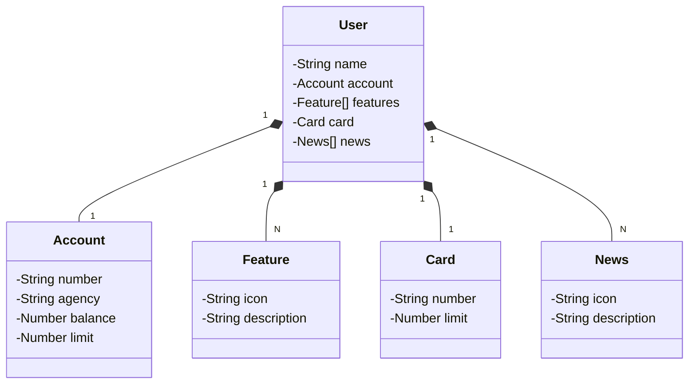

# Santander Dev Week 2023
Java RESTful API criada para a Santander Dev Week.

Projeto feito acompanhando a aula do bootcamp de Java do Santander, ministrada pelo professor [Venilton Falvo](https://github.com/falvojr). Essa aplicação é bem simples, sendo baseada na interface inicial do aplicativo do banco Santander.  
Quando esse projeto estiver rodando localmente pode ser acessado através do [link local](https://localhost:8080/swagger-ui.html), e o banco de dados em memória acessado através desse [link](https://localhost:8080/h2-console).

Segue abaixo o diagrama feito para ter criação de classes, implementações e heranças.

## Diagrama de Classes

##

 Feito por: Luiz Gustavo Santos Vieira  
 Acesso às minhas redes:

 Veja meus repositórios no [GitHub](https://github.com/LuizVieira11).  
 Veja meu perfil profissional do [LinkedIn](https://www.linkedin.com/in/luiz-gustavo-santos-vieira-b78031260/).  
 Meu [Instagram](https://www.instagram.com/luizsv11/) pessoal.

